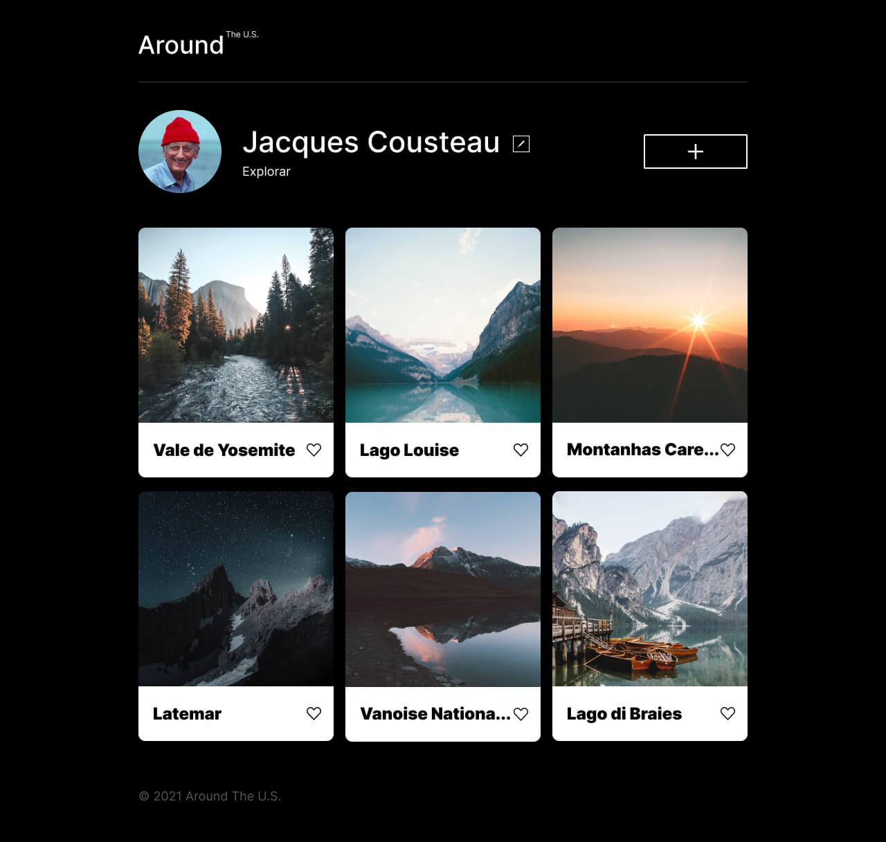

# 🌎 Around the U.S. :airplane:

## Sobre o Projeto

**Around the U.S.** é uma página web interativa onde os usuários podem adicionar, remover e curtir fotos de diferentes lugares dos Estados Unidos. É um projeto voltado para amantes da natureza e viajantes, oferecendo uma plataforma para compartilhar e descobrir belas paisagens.

## Funcionalidades

- :repeat: Alterar o nome do perfil
- ✨ Alterar a descrição (nome e bio)
- :camera: Adicionar novas fotos
- 🗑️ Remover fotos existentes
- ❤️ Curtir fotos
- :mag_right: Expandir as imagens

## Tecnologias Utilizadas

- **HTML**: Estruturação da página
- **CSS**: Estilização e layout
- **JavaScript**: Funcionalidades interativas

## Design

O design da página foi baseado em um layout criado na plataforma Figma. Abaixo, você pode ver uma prévia:

## Como Usar

:round_pushpin: Acesso à página web :arrow_heading_down:

   https://raimegomes.github.io/web_project_around

## 📬 Entre em Contato

Gostou do projeto ou tem alguma dúvida? Fique à vontade para entrar em contato! Você pode me encontrar no [LinkedIn](https://www.linkedin.com/in/raimeamador/) ou enviar um e-mail para [raime.gomes.dev@gmail.com](mailto:raime.gomes.dev@gmail.com).

Estou sempre aberta a novas oportunidades e colaborações! 😊